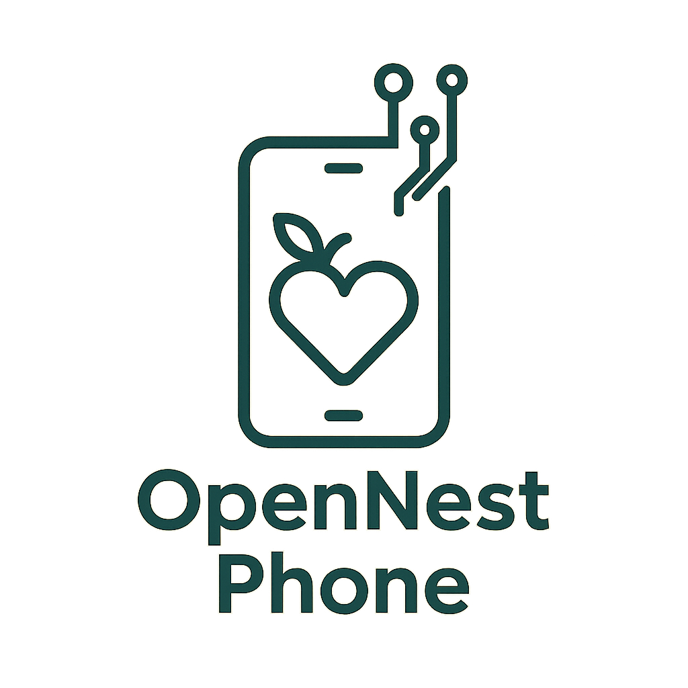

# 📱 OpenNest Phone

Welcome to my personal DIY smartphone journey!  
This is an open project where I aim to build a functional smartphone from scratch using modular components and a Linux-based operating system.

---

## 🎯 Project Goal

Build a working smartphone from individual parts, learning hardware and software integration along the way.  
The final goal is to:
- Have a functional Linux/Android-based smartphone
- Write and document the entire process (build log + GitHub)
- Learn about embedded systems, electronics, and mobile OS
- Possibly re-use parts from an old iPhone

---

## 🧩 Project Phases

| Phase | Name                              | Status        |
|-------|-----------------------------------|---------------|
| 1     | Setup repo + project log          | ✅ Done       |
| 2     | Research & select configuration   | 🔄 In progress |
| 3     | Create component list             | ⏳ Upcoming   |
| 4     | Order & test basic hardware       | ⏳ Upcoming   |
| 5     | OS setup & testing                | ⏳ Upcoming   |
| 6     | Final assembly + debugging        | ⏳ Upcoming   |
| 7     | Case design and customization     | ⏳ Upcoming   |

---

## 🛠 Current Focus

I'm currently researching PiPhone, PinePhone and Raspberry Pi-based builds to decide which direction to take.

---

## 📒 Build Log

➡️ You can follow my build diary in [BUILD_LOG.md](./BUILD_LOG.md)

---

## 📋 Components List

🛒 [Google Sheet – Component Tracker](https://docs.google.com/spreadsheets/d/1PMDCcWRCEQZ5AmUdThbVjq17toMNfsq5ATKp4kZCzG8/edit?usp=sharing)

---

## 🤝 Community & Inspiration

- PinePhone: https://www.pine64.org/pinephone/
- PostmarketOS: https://postmarketos.org
- ZeroPhone: https://hackaday.io/project/19035-zerophone-a-raspberry-pi-based-open-source-phone
- r/PinePhone on Reddit: https://www.reddit.com/r/PinePhone/
- Hackaday DIY Phones: https://hackaday.com/tag/cellphone/

---

## 🧠 Skills I'm building

- Hardware assembly
- OS installation and testing
- Shell and Python scripting
- Basic electronics and circuits
- Open-source contribution
- Markdown and GitHub usage

---

> “It always seems impossible until it’s done.” – Nelson Mandela

---
